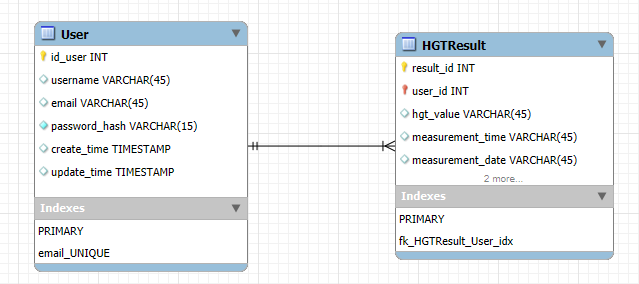
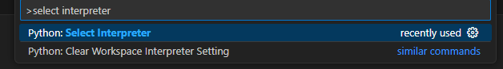
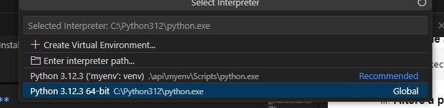
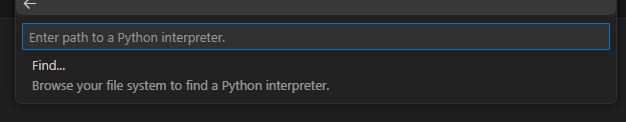
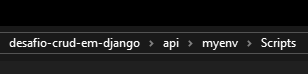
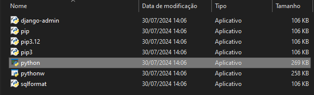

# diabetico

## Descrição
Sistema de Monitoramento de HGT para Diabéticos,
A aplicação será utilizada para armazenar e gerenciar os resultados das medições de HGT (Hemoglucoteste) realizadas diariamente por usuários diabéticos. Cada usuário terá um perfil individual, e os dados serão apresentados de forma clara e organizada, permitindo a consulta diária por meio de um calendário interativo.

## Resultados Esperados
- Criar, atualizar, remover e selecionar dados em um banco de dados.
- Armazenar os resultados das medições de HGT, incluindo o valor, horário e data.
- Exibir os dados de forma organizada, permitindo que o usuário selecione um dia específico no calendário para visualizar os resultados.

## Funcionalidades
- **Cadastro de Usuário:** Sistema de login e cadastro para cada usuário.
- **CRUD de Resultados:** 
  - Criar dados em um banco de dados (registrar medições de HGT).
  - Atualizar dados existentes.
  - Remover dados registrados.
  - Selecionar e visualizar dados filtrados por data.
- **Interface de Calendário:** Apresentação dos dados em um calendário interativo, permitindo a seleção de dias para consulta dos resultados de HGT.

## Tecnologias Utilizadas

- **Python**: Linguagem de programação principal.
- **Django**: Framework para desenvolvimento web e API.
- **MYSQL**: Banco de dados relacional para armazenamento dos dados.
- **Bootstrap**: Biblioteca CSS para o frontend.
- **FullCalendar**: Biblioteca JavaScript para o calendário interativo.

## Modelo Entidade-Relacionamento


## Instalação

Passo a passo de como configurar o ambiente de desenvolvimento e instalar as dependências.

1. Clone o repositório:
   ```bash
   git clone https://github.com/allysonlipe/diabetico.git
   ```

2. Navegue até o diretório do projeto:
   ```bash
   cd diabetico
   ```

3. Crie e ative um ambiente virtual:
   ```bash
   python -m venv myenv
   source myenv/bin/activate  # No Windows: myenv\Scripts\activate
   ```
   Caso encontre o seguinte erro:
   ```
   não pode ser carregado porque a execução de scripts foi desabilitada neste sistema.     
   Para obter mais informações, consulte about_Execution_Policies em 
   https://go.microsoft.com/fwlink/?LinkID=135170.
   No linha:1 caractere:3
   ```
   1. **Abra o PowerShell como Administrador;**
   &nbsp;
   2. **Verifique a política atual (opcional):**
      ```
      Get-ExecutionPolicy
      ```
   3. **Altere a política de execução para permitir scripts:**
      ```
      Set-ExecutionPolicy RemoteSigned
      ```
   4. **Confirme a alteração:**
         Quando solicitado, pressione Y e depois Enter para confirmar a alteração.
   5. **Tente ativar o ambiente virtual novamente:**
         ```
         source myenv/bin/activate  # No Windows: myenv\Scripts\activate
         ```


4. Pressione `Ctrl` + `Shift` + `P`, e ao abrir a janela abaixo, digite `Python: Select Interpreter` e selecione a opção marcada como na imagem abaixo: 
   

5. Agora, selecione a segunda opção da imagem, `Enter interpreter path`:
   
6. Agora, clique em `Find...`
   
7. O passo anterior irá abrir uma janela de gerenciador de arquivos, nessa janela, você vai selecionar o caminho da pasta scripts dentro da sua env, algo como `env\scripts`:
   

8. E selecionar o arquivo `python`:
   

## Licença

This project is under MIT license. See the [LICENSE](LICENSE.md) for more details.